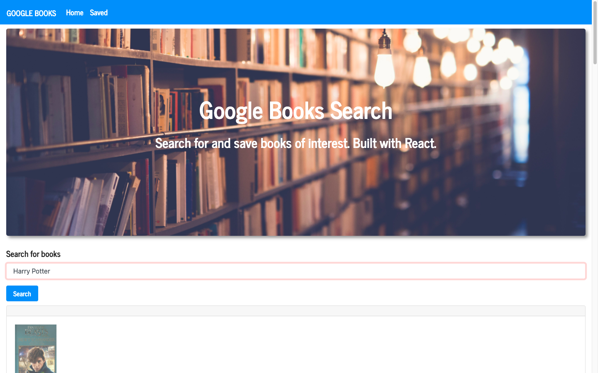

# Google-Books-Search

An application created using the MERN stack and allows users to search for books via the Google Books API. Search results are dynamically rendered in the UI and users have the option to save and/or delete books.

https://github.com/Noreldin-S/Google-Books-Search 

### Live Link to Deployed App

[UserDirectory](https://googbooksearc.herokuapp.com/)

### Technologies Used
 - React JS
 - MongoDB
 - Mongoose
 - Express JS
 - Node
 - Axios

## How it works

1. Users are first directed to the `Home` page where they can search for any book. Book information is retrived via the publicly available Google Books API.

2. Upon searching for a book, users will see a list of relevant results. They can click `save` to save the book to the `Saved` page. In the back end, the book is saved to the Mongo database.

3. Users can save as many books as they want. If they then go to the `Saved` page, they'll not only see books that have been saved by them, but also previous visitor's saved books (it's basically a shared space of saved books).

4. In either the `Home` or `Saved` pages, a user can click on the `View Book` button. This will redirect them to the Google Books store page where they can either purchase or read a preview of the book.

5. If a user wants to remove a saved book from the list, they may click the `Delete` button to remove the book from the page. In the back end, this deletes the document from the Mongo database.

## Visualization of App Interface

## Installation and Setup Instructions

If you'd like to view the app locally, you may clone down this repository. You will need `node`, `npm`, and `MongoDB` installed globally on your machine.  

Installation:

`npm install`  

To Start Server:

`npm start`  

To Visit App:

`localhost:3000`  

---

## Contribute

Please submit [bugs and feature requests](https://github.com/Noreldin-S/Google-Books-Search/issues)

### Author

[Noreldin Saad](https://github.com/Noreldin-S/)

